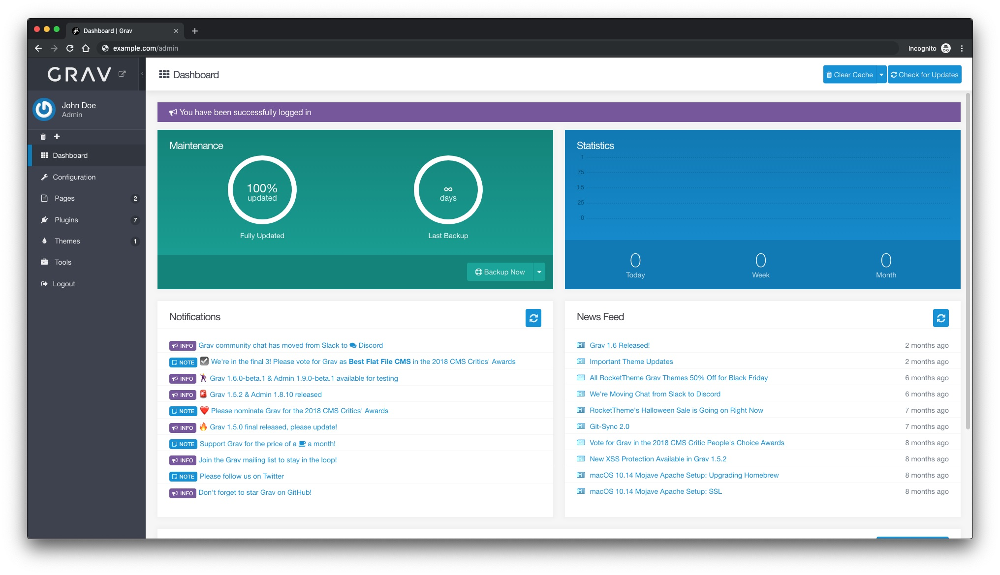

<!--
N.B.: This README was automatically generated by https://github.com/YunoHost/apps/tree/master/tools/README-generator
It shall NOT be edited by hand.
-->

# Grav pour YunoHost

[](https://dash.yunohost.org/appci/app/grav)    
[](https://install-app.yunohost.org/?app=grav)

*[Read this readme in english.](./README.md)*

> *Ce package vous permet d'installer Grav rapidement et simplement sur un serveur YunoHost.
Si vous n'avez pas YunoHost, regardez [ici](https://yunohost.org/#/install) pour savoir comment l'installer et en profiter.*

## Vue d'ensemble

Un CMS moderne basé sur des fichiers plats


**Version incluse :** 1.7.36~ynh1

**Démo :** https://getgrav.org/downloads/themes

## Captures d'écran



## Avertissements / informations importantes

* Vous pouvez accéder au panneau d'adminstration à l'adresse `votredomaine.tld/votrechemin/admin`. Les utilisateurs créés dans YunoHost peuvent se connecter, à condition de leur avoir octroyé la permission adéquate:
  * `grav.admin` pour qu'ils soient administrateur de Grav ;
  * `grav.user` pour qu'ils puissent se connecter, mais sans droit étendu.
* Grav offre un accès par SSH ou SFTP, activable dans le panneau de configuration de l'application dans l'administration de YunoHost.
  * Vous pouvez ainsi utiliser sa ligne de commande GPM.
    Référez-vous à sa documentation, mais sachez que vous devrez préciser la version de PHP utilisée par l'app:
    `php7.3 bin/grav ...` ou `php7.3 bin/gpm ...`
* Vous pouvez installer les extensions soit via le panneau d'administration, soit via GPM.
* Si vous installez Grav à la racin d'un domaine, sachez que les chemins d'accès commançant par `/yunohost` sont réservés.

## Documentations et ressources

* Site officiel de l'app : <https://www.getgrav.org/>
* Documentation officielle de l'admin : <https://learn.getgrav.org>
* Dépôt de code officiel de l'app : <https://github.com/getgrav/grav>
* Documentation YunoHost pour cette app : <https://yunohost.org/app_grav>
* Signaler un bug : <https://github.com/YunoHost-Apps/grav_ynh/issues>

## Informations pour les développeurs

Merci de faire vos pull request sur la [branche testing](https://github.com/YunoHost-Apps/grav_ynh/tree/testing).

Pour essayer la branche testing, procédez comme suit.

``` bash
sudo yunohost app install https://github.com/YunoHost-Apps/grav_ynh/tree/testing --debug
ou
sudo yunohost app upgrade grav -u https://github.com/YunoHost-Apps/grav_ynh/tree/testing --debug
```

**Plus d'infos sur le packaging d'applications :** <https://yunohost.org/packaging_apps>
